# Task Management App

## Setup Instructions

This is a task management application built with React on the frontend, RESTful APIs via NodeJS and MongoDB on the backend. It allows users to create, update, delete, and view tasks. The application uses the Chakra UI library for UI components.

### Prerequisites

Before running this application, make sure you have the following installed:

- **Node.js** (version >= 14)
- **MongoDB** (or MongoDB Atlas account if using cloud MongoDB)

### Frontend Setup

1. **Clone the repository:**

   ```bash
   git clone https://github.com/CharcoalF/Simple_Task_App.git
   ```

2. **Install dependencies:**

   ```bash
   npm install
   ```

3. **Start the development server:**

   _Note: You shall enter React_Related path to launch the web_

   - Go into the right path.

   ```bash
   cd React_Related
   ```

   - Then launch web server.

   ```bash
   npm run dev
   ```

   This will run the React frontend locally on [http://localhost:3000](http://localhost:3000).

### Backend Setup

1. **Install dependencies for the backend:**

   ```bash
   npm install express mongodb cors multer
   ```

2. **Start the backend server:**

   _Note: You shall enter Node_MongoDB_Related path to start the Database._

   - Go into the right path.

   ```bash
   cd Node_MongoDB_Related
   ```

   - Then launch Mongo DB server.

   ```bash
   node index.js
   ```

   The backend server will run on [http://localhost:55038](http://localhost:55038).

### MongoDB Setup

Make sure you have a MongoDB instance running locally or use a cloud-based instance like **MongoDB Atlas**.

- Create a database named `Simple_Task_Database`.
- Create a collection named `Simple_Task_Collection` inside the database to store the task data.

If you use **MongoDB Atlas**, make sure you update the MongoDB connection string (`CONNECTION_STRING`) in the `server.js` file with your Atlas credentials.

---

## API Endpoints

### 1. **GET `/api/React_Related/GetNote`**

- **Description**: Fetches all notes from the database.
- **Response**: Returns a JSON array of notes.

  Example Response:

  ```json
  [
    {
      "id": "1",
      "Title": "Task 1",
      "Description": "This is task 1",
      "Due_date": "15/02/2025",
      "Priority": "HIGH",
      "Status": "TODO",
      "Creation_Timestamp": "2025-02-09T00:00:00.000Z",
      "Last_Updated_Timestamp": "2025-02-09T00:00:00.000Z"
    }
  ]
  ```

### 2. **POST `/api/React_Related/AddNotes`**

- **Description**: Adds a new task to the database.
- **Request Body**: The following fields are required:

  - `Title`: The title of the task (string).
  - `Description`: A brief description of the task (string).
  - `Due_date`: The due date for the task in `DD/MM/YYYY` format (string).
  - `Priority`: The priority level of the task (`LOW`, `MEDIUM`, `HIGH`).
  - `Status`: The current status of the task (`TODO`, `IN_PROGRESS`, `DONE`).

  Example Request Body:

  ```json
  {
    "Title": "New Task",
    "Description": "Description of new task",
    "Due_date": "15/02/2025",
    "Priority": "HIGH",
    "Status": "TODO"
  }
  ```

- **Response**: Returns a success message after adding the task.
  ```json
  {
    "message": "Added Successfully",
    "result": { ...task details... }
  }
  ```

### 3. **DELETE `/api/React_Related/DeleteNote`**

- **Description**: Deletes a note by its `id`.
- **Request Body**:

  - `id`: The `id` of the note to be deleted.

  Example Request Body:

  ```json
  {
    "id": "1"
  }
  ```

- **Response**: Returns a success message after deleting the task.
  ```json
  {
    "message": "Note deleted successfully"
  }
  ```

---

## Approach, Assumptions, and Limitations

### Approach

- **Frontend**: The frontend is built with React and uses Chakra UI components for the UI. React hooks are used for managing state, and `fetch` is used to communicate with the backend API.
  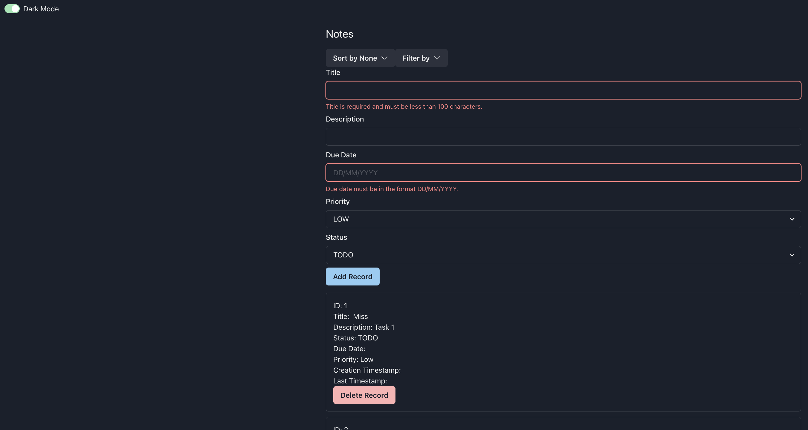
  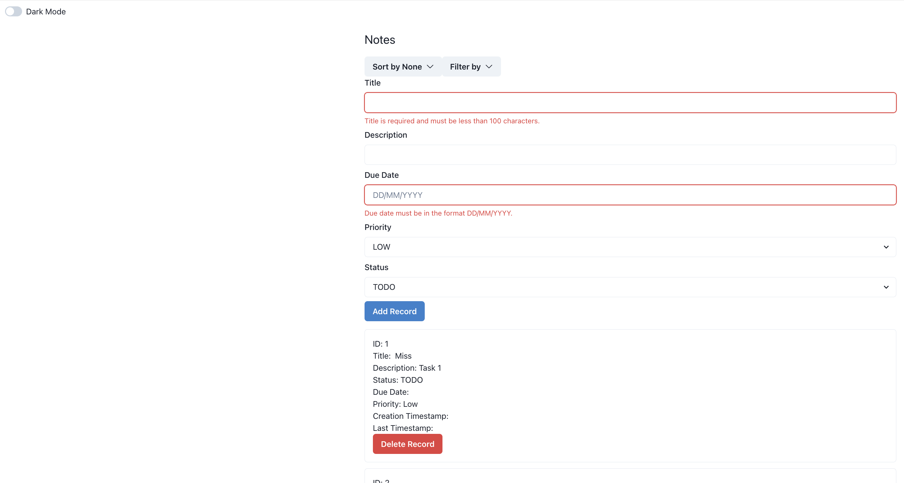
- **Backend**: The backend is built using Express.js and MongoDB as the database. MongoDB is used to store the task notes and to perform CRUD operations.
  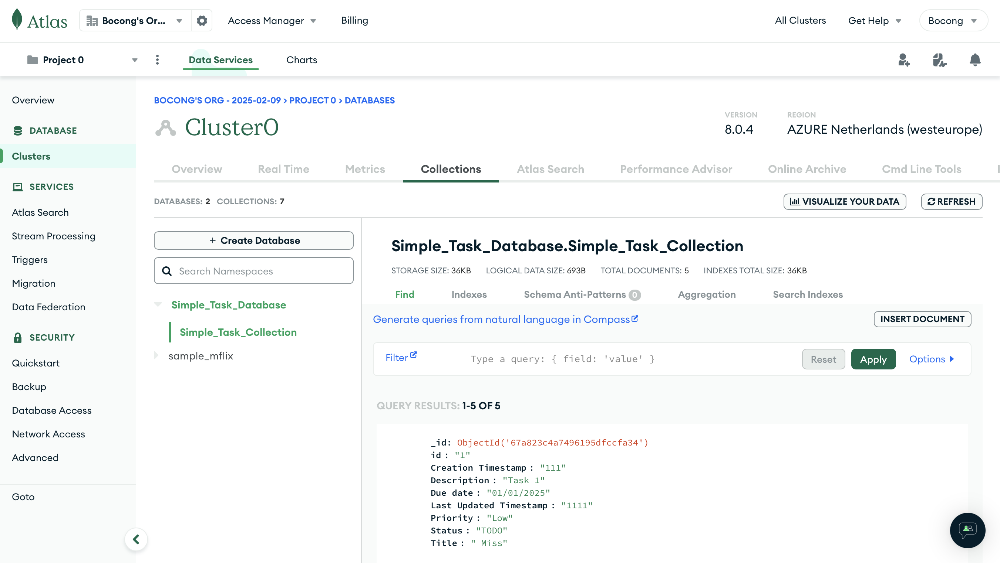
  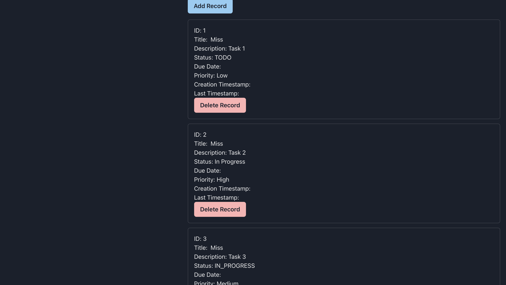
- **Validation**: Some basic validation is done on the frontend to ensure that the fields (such as `Title`, `Description`, `Due_date`) follow the correct format.
  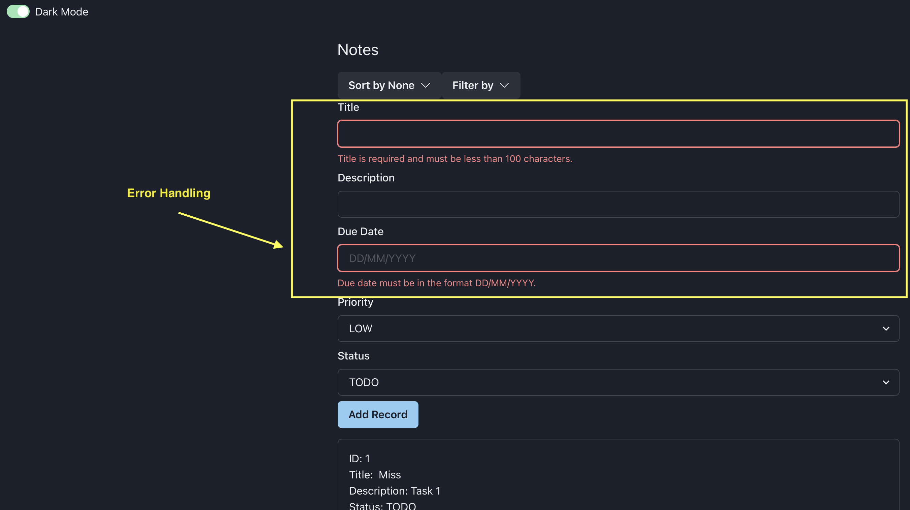
- **Sorting**: The frontend includes sorting by task status, priority, and due date.
  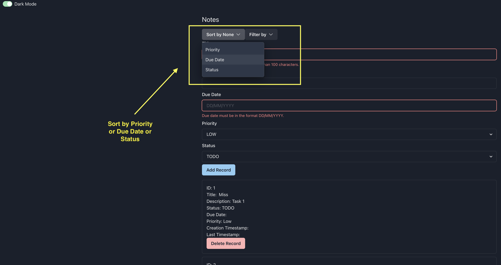
- **Filtering**: The frontend includes filtering by task status, priority, and due date.
  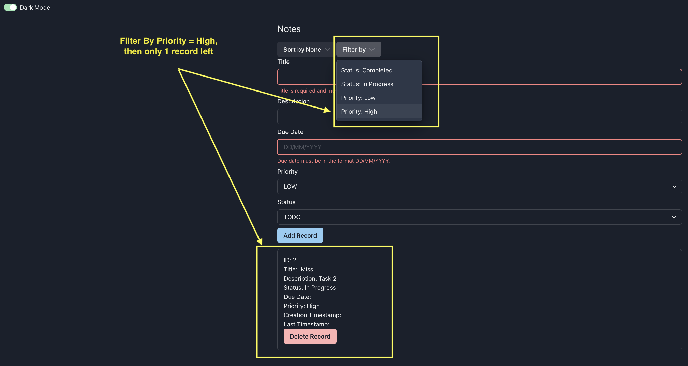
- **Drop-down List**: The frontend includes options for users to select.
  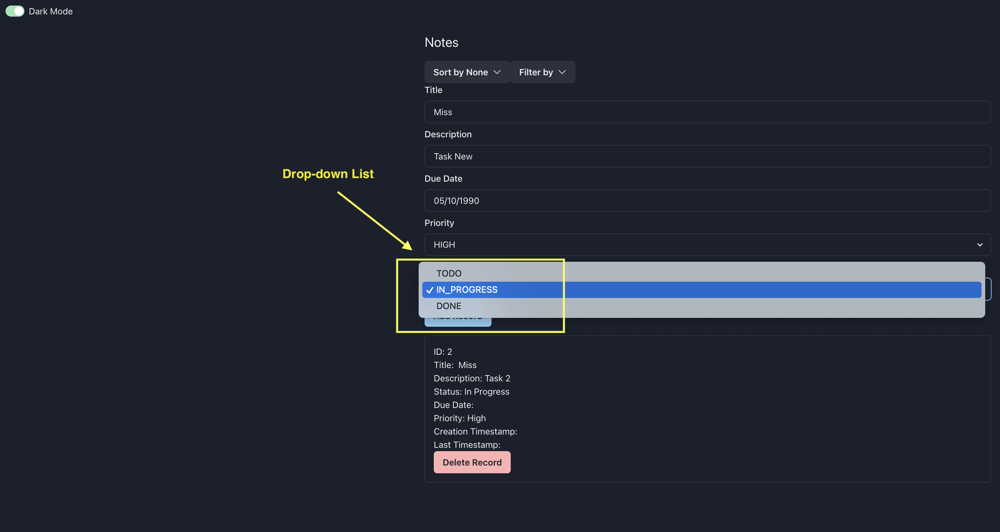
  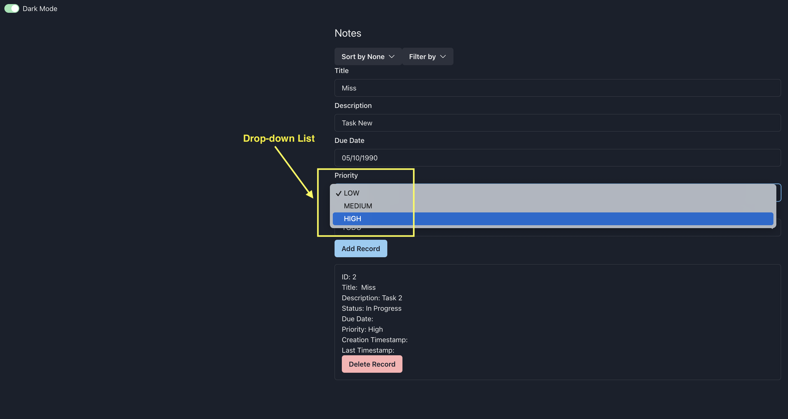
- **Add record**:
  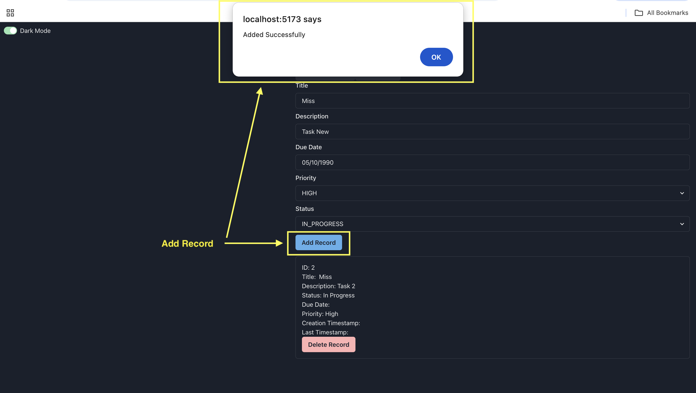
- **Delete record**:
  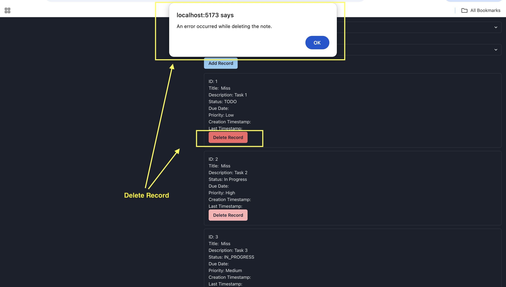

### Assumptions

- The backend will be hosted locally or on a server that can be accessed at `http://localhost:55038`.
- MongoDB (either local or Atlas) is available and running, and the correct connection string is provided.
- The application is designed to be used by a single user or a small group of users.

### Limitations

- **Authentication**: There is no user authentication or authorization in this application. All users have access to the same data.
- **Scalability**: While MongoDB is used for storage, the app is not optimized for large-scale deployments or high traffic.
- **Data Persistence**: Data is stored in the local MongoDB instance, so if the database is cleared, all notes will be lost.

---

## Author

- **Bocong Zhao**  
  Email: bocongzhao@163.com  
  GitHub: [GitHub Profile](https://github.com/CharcoalF)
